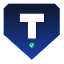

<p align="center">
  
</p>

<h1 align="center">PROD Guard</h1>

<p align="center"><strong>Never break production again.</strong></p>

A Chrome extension that shows a big red warning banner when you visit production URLs — so you don't accidentally delete real customer data, run destructive scripts, or send test emails from a prod inbox.

Free forever. Built by [Testovex](https://testovex.com).

---

## Why PROD Guard?

Every engineer has done it at least once:
- Ran `DELETE FROM users` on the wrong tab.
- Sent a "hey testing" email to 40,000 real customers.
- Deployed staging config to prod.
- Truncated a table thinking it was the local DB.

PROD Guard is a lightweight visual seatbelt. It watches every tab you open. If the URL matches one of your rules (default: `prod`, `production`, `/admin`, `live.`), it pins a bright red banner to the top of the page. You can't miss it.

---

## Features

- **Zero-config out of the box** — 3 default rules cover the most common cases.
- **Fully customizable rules** — substring or regex, case-sensitive or not, critical (red) or warning (orange).
- **Live URL tester** — paste any URL to see which rules match, before you commit.
- **Session-scoped dismiss** — click "Dismiss" and the banner hides until you reload or open a new tab. Won't survive a fresh visit.
- **Optional sound alert** — subtle beep on critical matches.
- **Syncs across your Chrome instances** via `chrome.storage.sync` — set up once, protected everywhere you sign in.
- **No tracking, no analytics, no external network calls.** Everything runs locally.

---

## Installation (Developer Mode)

Until it's live on the Chrome Web Store, install it manually:

1. Download or clone this folder to your computer.
2. Open Chrome → `chrome://extensions/`.
3. Turn on **Developer mode** (top-right toggle).
4. Click **Load unpacked**.
5. Select this `prod-guard/` folder.
6. Done. The PROD Guard shield icon appears in your Chrome toolbar. The options page opens automatically on first install with 3 pre-seeded rules.

---

## Default Rules

| # | Label | Type | Pattern | Severity |
|---|-------|------|---------|----------|
| 1 | Prod / Production keywords | regex | `\b(prod\|production)\b` | Critical |
| 2 | Admin panels | substring | `/admin` | Warning |
| 3 | Live subdomains | regex | `//live[.\-]` | Warning |

Edit, delete, disable, or add your own from the options page.

---

## Adding Custom Rules

Common examples:

| What to protect | Type | Pattern |
|---|---|---|
| Real AWS Console | substring | `console.aws.amazon.com` |
| Company production app | substring | `app.acme.com` |
| Any `.com` domain (broad) | regex | `\.com($\|/)` |
| Stripe live mode | substring | `dashboard.stripe.com` |
| Airflow prod DAGs | substring | `airflow.prod` |
| Datadog prod org | substring | `app.datadoghq.com/dashboard/prod` |

Tip: For team-shared rules, take a screenshot of your options page and share with new hires as a starting config.

---

## Architecture (for the curious)

- **Manifest V3.** Service worker + content script + popup + options.
- **content_script.js** runs on every page (`<all_urls>`), matches the URL against your rules, and injects a fixed-position banner with `z-index: 2147483647` so it always sits on top.
- **CSS is namespaced** with `prod-guard-` prefix and uses `!important` to survive host-page styles.
- **No external assets** — the banner draws itself, the alert sound is Web Audio API, icons are embedded. Nothing is fetched over the network at runtime.
- **Storage** uses `chrome.storage.sync` (~100 KB budget, plenty for hundreds of rules).

Files:

```
prod-guard/
├── manifest.json          Extension manifest (v3)
├── background.js          Service worker: defaults + install hook
├── content_script.js      URL matcher + banner injector
├── banner.css             Injected banner styles (namespaced, !important)
├── popup.html/css/js      Toolbar popup: current tab status + toggles
├── options.html/css/js    Settings page: rules CRUD + URL tester
├── icons/                 16/48/128 PNG icons
├── build-icons.py         Regenerate icons if you want to tweak the design
└── README.md              This file
```
---

## Roadmap (post-v1.0)

- **Team rules** — sync rules via a shared JSON URL or Testovex account.
- **Auto-import from environment variables** — read `NODE_ENV=production` cues from meta tags.
- **Slack/Teams webhook** on critical matches (opt-in).
- **Read-only mode** — inject CSS that greys out `<button>` elements matching a pattern (e.g., all buttons containing "Delete").
- **Right-click context menu** to add current URL as a rule in one click.

---

## License

MIT. Do what you want with it. If you fork it, please leave the Testovex footer in place.

---

## About Testovex

PROD Guard is a free companion to [Testovex](https://testovex.com) — the enterprise no-code test automation platform for QA teams that ship faster without hiring 40 automation engineers.

If you like the "guardrails for engineers" philosophy behind PROD Guard, you'll love what we do for regression testing at scale.

— Puneet Kamboj, Founder
